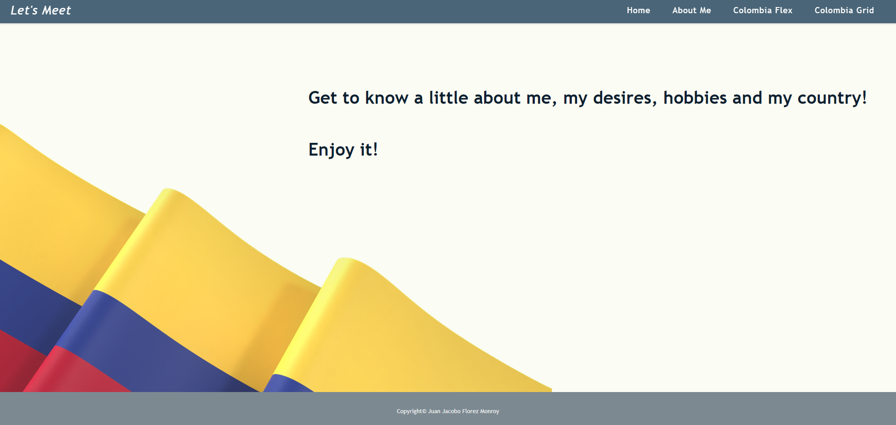
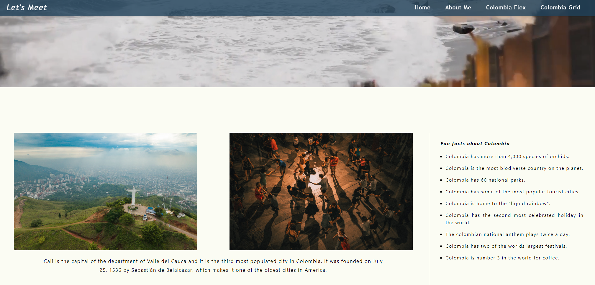

# 🌎 Let's Meet

## 📌 Project Overview

**Let's Meet** is a **personal website** designed to introduce myself, my hobbies, and my country, **Colombia**. This project demonstrates different **web development techniques**, including **CSS Flexbox and Grid layouts**. The website features various sections such as an **About Me page**, a **Homepage**, and **dedicated pages for Colombia**.

Developed as an **individual college assignment**, this project highlights **responsive design** and structured content organization.

---

## 🚀 Features

- 👤 **About Me Page** – Provides a personal introduction.
- 🏡 **Homepage** – Displays an overview of the website.
- 🌎 **Colombia Sections**:
  - 📐 **Colombia Flex Page** – Uses **CSS Flexbox** for layout.
  - 📊 **Colombia Grid Page** – Uses **CSS Grid** for layout.
- 🎨 **Responsive Design** – Optimized for various screen sizes.

---

## 🛠 Technologies Used

- **HTML5** → Structure of the website.
- **CSS3 (Flexbox & Grid)** → Layout styling and responsiveness.
- **Responsive Design Techniques** → Media queries for mobile optimization.

---

## 🎯 Project Purpose

This project was created as part of a **college assignment**, allowing me to practice:

- ✅ **CSS Flexbox and Grid** for layout design.
- ✅ **Responsive web development** for different devices.
- ✅ **HTML structure and semantic design**.

---

## 📂 Project Structure

```
📁 lets_meet_project
 ├── 📄 index.html          # Homepage
 ├── 📁 pages/              # HTML Files  
 │   ├── 📄 about.html          # About Me page
 │   ├── 📄 topic_flex.html     # Colombia page using Flexbox
 │   ├── 📄 topic_grid.html     # Colombia page using CSS Grid
 ├── 📁 css/                # Stylesheets
 │   ├── style.css         # General styles
 │   ├── index.css         # Homepage styles
 │   ├── about.css         # About page styles
 │   ├── topic_flex.css    # Styles for Flexbox layout
 │   ├── topic_grid.css    # Styles for CSS Grid layout
 ├── 📁 imgs/               # Image assets
 ├── 📁 videos/             # Video assets
```

---

## 📌 Prerequisites

To run the project, ensure you have:

- A **modern web browser** (Chrome, Firefox, Edge, etc.).

---

## 🏃‍♂️ How to View the Website

1️⃣ **Open** `index.html` in a web browser.  
2️⃣ **Navigate** through the website using the **menu**.  

---

## 🎭 Screenshots  

| Home | Colombia |
|--------------|--------------|
|  |  |

---

## 📜 License

This project was developed for **educational purposes** as part of a **college assignment**.

---

## 💼 Author

👤 **Juan Jacobo Florez Monroy**  
🌐 **Portfolio**: [jjacobo95.com](https://jjacobo95.com)  
🐙 **GitHub**: [github.com/jjacoboflorez95](https://github.com/jjacoboflorez95)